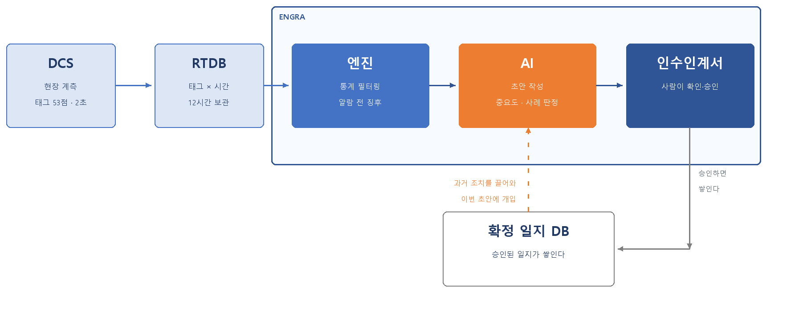
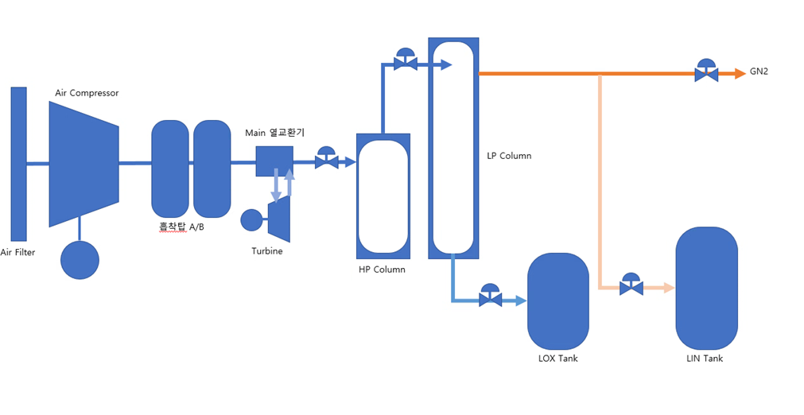

# 회의 01 — 무엇을 만들 것인가 — 공정 범위와 시나리오 규모

| | |
| --- | --- |
| **일시** | 2026-08-13 (목) 18:10 ~ 19:20 |
| **참석** | 박경모 · 정기영 · 임도영 |
| **장소** | 생산팀 사무실 |

## 이날 세운 기틀

무엇을 만들 것인지부터 그림 하나로 맞췄다. **정확한 설계가 아니라 얼개**다 —
이 뒤의 모든 결정이 이 그림의 어느 칸을 채우는 일이었다.

- **DCS → RTDB** 는 임도영이 만든다. 실제 설비를 못 쓰니 **가상 공정을 새로 만든다**
- **엔진(필터링)** 은 정기영이 맡는다. 알람이 못 잡는 것을 통계로 찾는다
- **AI(초안 작성)** 와 **인수인계서** 는 박경모가 배선한다
- **확정 일지 DB 로 빠지는 옆 가닥이 핵심**이다. 승인된 일지가 쌓여
  다음 근무 초안을 쓸 때 「과거 조치」 로 다시 들어온다.
  **이 되먹임이 없으면 그냥 알람 요약기다**

## 안건 1 — 가상 ASU 공정을 어디까지 만들 것인가 (임도영)

실제 설비 태그와 운전 수치는 못 쓴다(대회 보안 가이드). **가상 ASU 를 새로 만든다.**
너무 적으면 공정이 설명되지 않고, 너무 많으면 12시간 데이터가 감당이 안 된다.

**결정**
- **태그 53점.** 한 ASU 를 설명할 최소 규모로 잡는다
- **유닛 9개** — AIR FILTER `F-101` / COMPRESSOR `K-201` / ADSORBER `A-301·302` /
  COLD BOX / COLUMN / TURBINE / PRODUCT TANK / GN2 / 대기
- **명명 규칙** — 접두 알파벳 + 3자리, 앞자리가 설비 구분
- **태그 마스터 CSV 를 단일 출처로 둔다** — 정상값·정상범위·LL·L·H·HH·드리프트·노이즈·연동

### 회의에서 그린 공정 흐름 초안

이 그림이 태그 배치의 출발점이 됐다. 왼쪽부터 **Air Filter → Air Compressor →
흡착탑 A/B → Main 열교환기 → HP Column → LP Column**, 아래로 **Turbine**,
오른쪽에 **LOX Tank · LIN Tank** 와 **GN2** 출하 라인이다.

계측 태그는 **흐름이 갈리거나 상태가 바뀌는 자리**에 붙였다 — 압축기 토출, 흡착탑 후단,
열교환기 Cold end, 컬럼 레벨·차압, 탱크 레벨. 그래서 태그 53점이 임의로 정한 숫자가 아니라
**이 흐름도에서 셀 수 있는 지점의 수**다.

밸브(`FV-`·`LV-`·`PV-`)와 설비(`F-101`·`K-201`·`A-301`)는 그림에 있지만 **계측 태그가 아니다** —
태그 마스터에는 안 들어간다.

## 안건 2 — 시나리오를 몇 종 만들 것인가 (박경모)

제품이 「알람이 안 울리는 이상」 을 잡는 것이므로, 시나리오 구성이 곧 주장의 근거가 된다.

**결정**
- **총 20종 — 알람 미발생 13종 + 알람 발생 7종**
- 미발생 13종이 ENGRA 의 존재 이유. 판정은 **「잡았는가」**
- 발생 7종은 판정을 **「알람보다 먼저 잡았는가」** 로 둔다
- **HH·LL(설비정지 수준)은 넘지 않는다** — 근무 중 조치가 필요한 수준으로 잡는다

### 주입은 일단 보수적으로 — 근무당 1~2건

시나리오를 한 근무에 몇 건씩 넣을지도 이날 잠깐 다뤘다. **근무당 1~2건**으로 시작하기로 했다.

- 여러 개를 겹치면 **어느 파형이 어느 시나리오 것인지 우리도 모르게 된다**
- 검출기가 아직 없어서 **채점을 사람 눈으로 해야 하는데**, 겹치면 눈으로 못 센다
- 정답지 형식도 안 정해졌다. 단순한 것부터 맞춰 보고 늘리자

> **이 결정은 회의 03 에서 뒤집힌다** — 근무당 **6~10건 · 중복 허용**으로 바꿨다.
> 1~2건짜리 근무를 만들어 보니 **실제 교대와 너무 달랐다.** 현장은 이상이 하나씩
> 얌전히 오지 않는다. 「우리가 채점하기 쉬운 데이터」 를 만들고 있었던 것이다.
> 채점은 정답지 JSON 을 만들어 자동화하는 쪽으로 풀었다.

## 안건 3 — 검출이 무엇을 대상으로 삼을 것인가 (정기영)

**결정**
- 알람 로직을 다시 만드는 것이 아니다. **알람이 구조적으로 못 잡는 것**만 대상으로 한다
- 그래서 검출기는 「한계 초과」 가 아니라 **추세·변동폭·상관**을 본다

## 같이 일하는 규칙 (박경모)

셋이 같은 저장소를 쓰니 충돌부터 막자고 했다. **세 가지만 지킨다.**

1. **남의 파일을 고치지 않는다.** `app/` 박경모 · `engine/` 정기영 · `docs/` 임도영.
   담당 밖을 고쳐야 하면 **먼저 담당자에게 알리고** 한다
2. **한 가지가 끝나면 바로 커밋하고 푸시한다.** 오래 들고 있을수록 충돌이 커진다
3. **필요한 것은 이슈로 요청하고, 처리하면 댓글 달고 닫는다.** 커밋 메시지에 `(#번호)` 를
   적어 잇는다 — 나중에 「왜 이렇게 했나」 를 되짚을 수 있어야 한다

> **커밋 메시지가 곧 제출물이다.** 04 제작 과정을 커밋에서 자동 생성하기로 했으니
> 「왜 · 무엇을 · 어떻게 확인했나」 를 본문에 적는다. 한 줄짜리 커밋은 나중에 아무것도 안 남는다.

## 할 일
- 임도영 — 태그 마스터 초안 + Overview 화면
- 박경모 — 시나리오 20종 목록 확정, 이슈로 요청
- 정기영 — 검출기 종류 후보 정리
